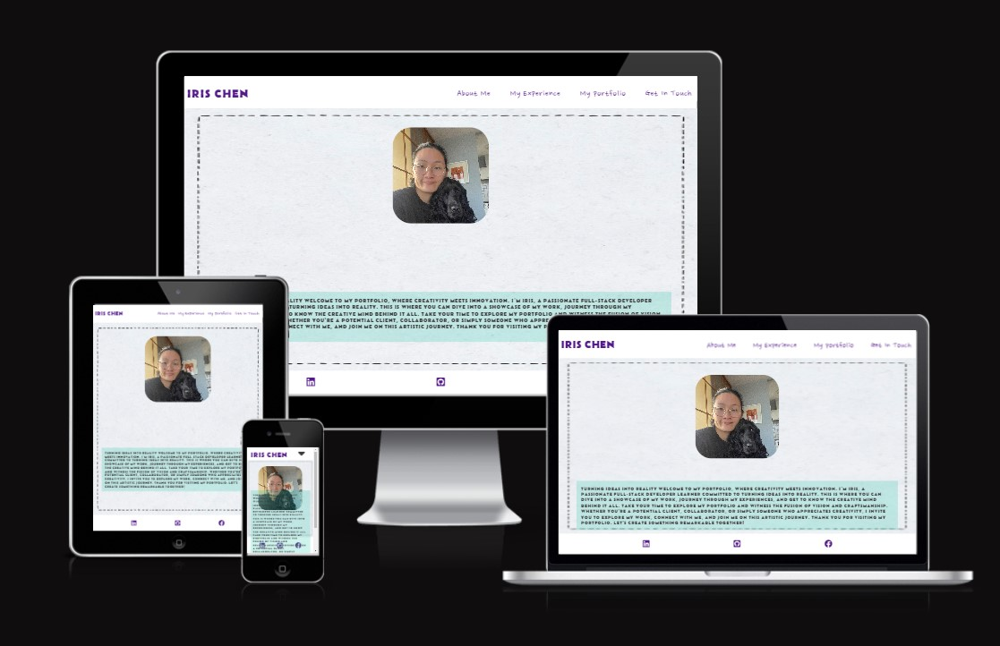
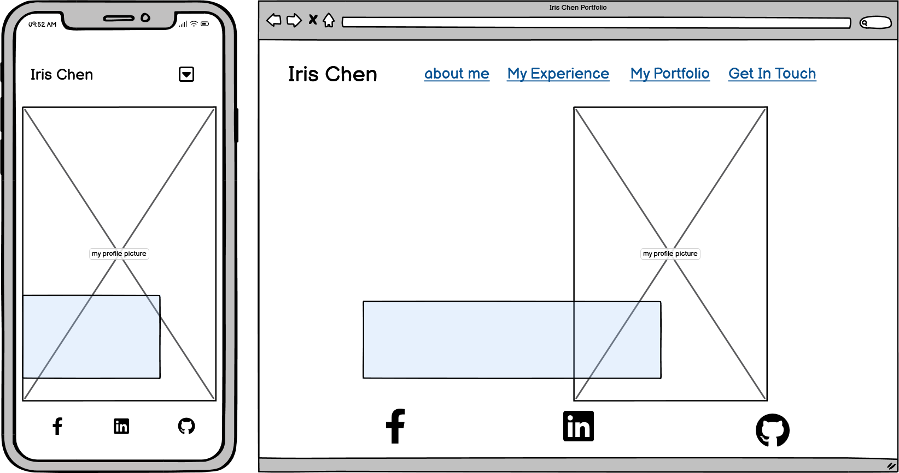
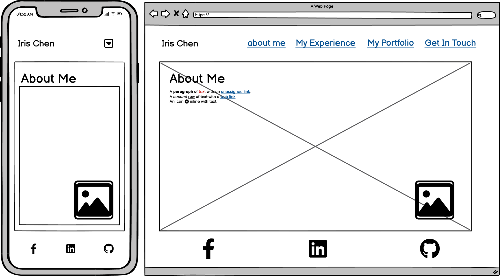
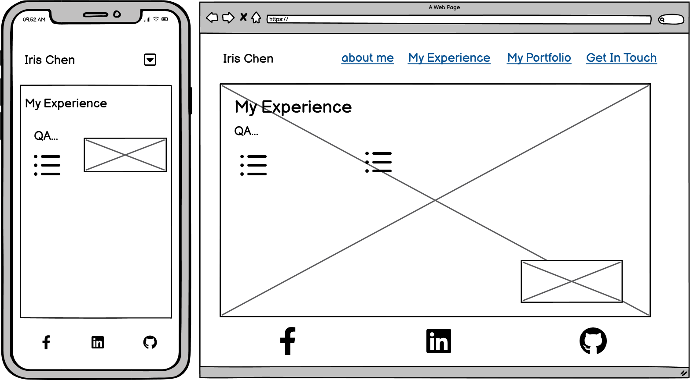
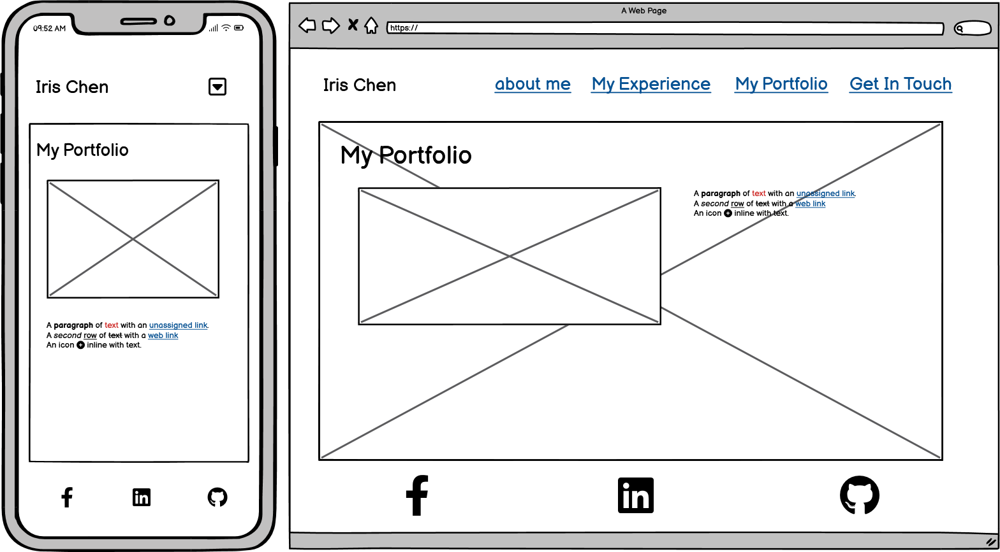

# Iris Chen Portfolio

## overview 

[Link to my Portfolio website.](https://hsiaohan-89.github.io/Iris-Chen-portfolio/)

## Table of content

1. [Iris Chen](#iris-chen)
1. [UX](#ux)
2. [Ideal User Demographic](#ideal-user-demographic)
3. [User Stories](#user-stories)
3. [Development Planes](#development-planes)
4. [Design](#Design)
5. [Features](#Features)
    1. [Design Features](#Design-Features)
    2. [Existing Features](#existing-features)
    3. [Features to Implement in the future](#Features-to-Implement-in-the-future)
6. [Issues and Bugs](#Issues-and-Bugs)
7. [Technologies Used](#Technologies-Used)
     1. [Main Languages Used](#Main-Languages-Used)
     2. [Frameworks, Libraries & Programs Used](#Frameworks,-Libraries-&-Programs-Used)
8. [Testing](#testing)
     1. [Testing.md](TESTING.md)
9. [Deployment](#deployment)
     1. [Deploying on GitHub Pages](#Deploying-on-GitHub-Pages)
10. [Credits](#Credits)
     1. [Content](#content)
     2. [Media](#Media)
     3. [Code](#Code)
11. [Acknowledgements](#Acknowledgements)

***

## Iris Chen

This it's a Hello page with simple introduction of my self and why I'm making this website for myself as starting my journey to become a full-stack sofeware developer, as I will put all my future work here and my experiences we well as people will able to have all the links in my portfolio page and will able to contact me in my get in touch page.

[Back to top ⇧](#iris-chen-portfolio)

## UX
### Ideal User Demographic
The ideal user for this website is :

* Anyone who has interest in web developement

### User-Stories
### Goals
1. I will regular update the portfolio page for my all the works in the future.
2. I will have update of my webpage that sasily assess all the information.
3. I will update the navitation of each my pages.
4. I will update the get in touch page with more information.

### Development-Planes
To keep update and imporve the design for all the user and give more responvive experience.

#### Strategy
This website mainly for experience exchange or advice to imporve my portfolio or expand my connections. The website will focus on the following target audience bewlo:
- **Roles:**
  -  anyone
  -  Junior full-stack software developer 
  - Experienced full-stack software developer

- **Demographic:**
  - All ages
  - people from everywhere

#### Scope
The scope is for advice and experience exchange and build more connection help each grow together with their coding journey.
- Content Requirement :
   - The user will be looking for :
     - My experience 
     - My portfolio 
     - Get in touch with me
- Functionality Requirements:
  - The user will be able to :
     - Be able to easily navigate the site to find the information they looking for
     - Be able to contact the site to get in touch with and exchange the experience

#### Skeleton
Wireframes were made to showcase the appearance of the site pages while keeping a positive user experience in mind. The wireframes were created using a desktop version of [Balsamiq](https://balsamiq.com/).

Balsamiq Wireframes

  
### Design

#### Typography
The typography pairing used on the site are [Belanosima](https://fonts.google.com/specimen/Nanum+Pen+Script?preview.text=hello&preview.text_type=custom&query=Nanum+Pen+Script) and [Nanum Pen Script](https://fonts.google.com/specimen/Nanum+Pen+Script?preview.text=hello&preview.text_type=custom&query=Nanum+Pen+Script), imported from [Google Fonts](https://fonts.google.com/).A backup of Sans-Serif had been applied in case of import failure.

Belanosima was chosen for the title on the header, and using for the heading, Nanum Pen Script using for content.

#### Imagery
The selected image it's for user to get to know the web developer more.

[Back to top ⇧](#iris-chen-portfolio)
