# Iris Chen Portfolio

## overview

[Link to my Portfolio website.](https://hsiaohan-89.github.io/Iris-Chen-portfolio/)

## Table of content

- [Iris Chen Portfolio](#iris-chen-portfolio)
  - [overview](#overview)
  - [Table of content](#table-of-content)
  - [Iris Chen](#iris-chen)
  - [UX](#ux)
    - [Ideal User Demographic](#ideal-user-demographic)
    - [User-Stories](#user-stories)
    - [Goals](#goals)
    - [Development-Planes](#development-planes)
      - [Strategy](#strategy)
      - [Scope](#scope)
      - [Skeleton](#skeleton)
    - [Design](#design)
      - [Typography](#typography)
      - [Imagery](#imagery)
      - [Icons](#icons)
  - [Features](#features)
    - [Design Features](#design-features)
    - [Existing Features](#existing-features)
    - [Features to Implement in the future](#features-to-implement-in-the-future)
  - [Issues and Bugs](#issues-and-bugs)
  - [Technologies Used](#technologies-used)
    - [Main Languages Used](#main-languages-used)
    - [Frameworks, Libraries \& Programs Used](#frameworks-libraries--programs-used)
  - [Testing](#testing)
    - [Manual Testing](#manual-testing)
  - [Deployment](#deployment)
    - [Deploying on GitHub Pages](#deploying-on-github-pages)
  - [Credits](#credits)
    - [Content](#content)
    - [Media](#media)
    - [Code](#code)
  - [Acknowledgements](#acknowledgements)

---

## Iris Chen

This it's a Hello page with a simple introduction of myself and why I'm making this website for myself as I start my journey to become a full-stack software developer, I will put all my future work here and my experiences we well as people will able to have all the links in my portfolio page and will able to contact me in my get in touch page.

[Back to top ⇧](#iris-chen-portfolio)

## UX

### Ideal User Demographic

The ideal user for this website is :

- Recruiter
- Employer
- Head Hunter

### User-Stories

### Goals

- Provide user's iris chen working experience and background
- Give information about Iris Chen's personality
- To show the user's iris Chen's location and get in touch with
- The information about Iris Chen's project work.

### Development-Planes

To keep updated and improve the design for all the users and give a more responsive experience.

#### Strategy

This website is mainly for experience exchange or advice to improve my portfolio or expand my connections. The website will focus on the following target audience below:

- **Roles:**

  - anyone
  - Junior full-stack software developer
  - Experienced full-stack software developer

- **Demographic:**
- Recruiter
- Employer
- Head Hunter

#### Scope

The scope is for advice and experience exchange and building more connections help each grow together with their coding journey.

- Content Requirement :
  - The user will be looking for :
    - My experience
    - My portfolio
    - Get in touch with me
- Functionality Requirements:
  - The user will be able to :
    - Be able to easily navigate the site to find the information they looking for
    - Be able to contact the site to get in touch with and exchange the experience

#### Skeleton

Wireframes were made to showcase the appearance of the site pages while keeping a positive user experience in mind. The wireframes were created using a desktop version of [Balsamiq](https://balsamiq.com/).

Balsamiq Wireframes

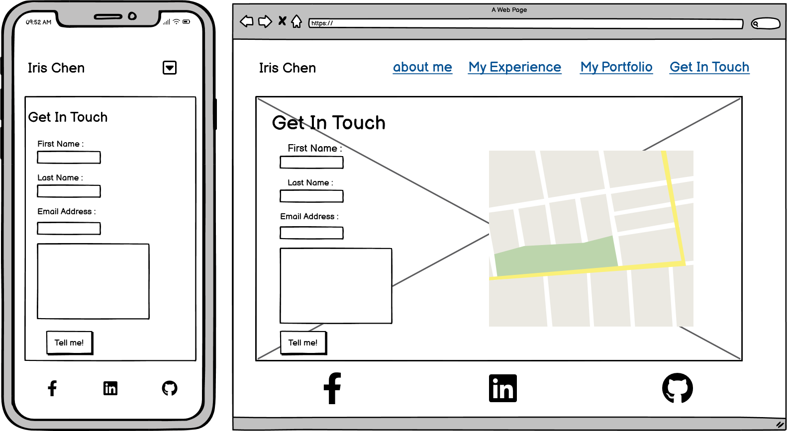

  
### Design

#### Typography

The typography pairing used on the site are [Belanosima](https://fonts.google.com/specimen/Nanum+Pen+Script?preview.text=hello&preview.text_type=custom&query=Nanum+Pen+Script) and [Nanum Pen Script](https://fonts.google.com/specimen/Nanum+Pen+Script?preview.text=hello&preview.text_type=custom&query=Nanum+Pen+Script), imported from [Google Fonts](https://fonts.google.com/).A backup of Sans-Serif had been applied in case of import failure.

Belanosima was chosen for the title on the header, and using for the heading, Nanum Pen Script using for content.

#### Imagery

The selected image it's for user to get to know the web developer.

#### Icons

The icons resources is from [Font Awesome](https://fontawesome.com/). As with different page has differnet function give relate icon.

[Back to top ⇧](#iris-chen-portfolio)

## Features

### Design Features

Each page has a consistent and responsive navigation bar. please see the below details :

- The **Header** is across the top of the page.
- The **Navigation bar** is positioned on the right top of the page. The navigation bar is used for screens 768px 992px and 1200px. The screen smaller than 768px will be replaced by a dropdown icon.
- The **Navigation bar** collapses into a **dropdown icon**, when clicked or tapped, opens a menu shows the different category.
- The **Footer** stays at the bottom of the screen at all times, on all screen sizes. Each social link opens in a new tab.

<dl>
    <dt><a href="index.html" target="_blank" alt="Iris Chen portfolio page">Home Page</a></dt>
    <dd>
 The <em>Home Page</em> main content contains a photo and a paragraph, according to different screen sizes the content will fit within the screens.
  <ul>
  <li>
  <em>Image</em>-This image is to show users that welcome to my portfolio page.
  </li>
  <li><em>Paragraph</em>- This Paragraph it's to show users why I want to create this place and what's my purpose.</li>
  </dd>
</dl>

<dl>
<dt><a href="aboutme.html" target="_blank" alt="About me page">About Me</a></dt>
<dd>
The <em>About me</em> It's more deatil about me and with few life image.
<ul>
    <li><em>Paragraph</em>- It's a short introduction about myself, and my professional background.</li>
    <li>
    <em>Image</em>- The image of the developer.
    </li>
    </dd>
</dl>

<dl>
<dt><a href="experience.html" target="_blank" alt="My experience detail page">My Experience</a></dt>
<dd>
The <em>My experience</em> contain my education histroy and my working experience.
<ul>
    <li><em>Paragraph</em>- It tells the user my professional and my job history.
    </li>
    <li><em>Icon</em> - The different section has related icon.
    </li>
</dd>
</dl>

<dl>
<dt><a href="protfolio" target="_blank" alt="My Portfolio page">My Portfolio</a></dt>
<dd>
The <em>My portfolio</em> contain of my work, as I'm starting my journey with full-stack software development, I will continuously post my work here to share my experience.
<ul>
    <li><em>Paragraph</em>- Explain my project and why I created this project.
    </li>
    <li><em>Image</em> - A mockup image to give uset quick view of my project and with different size screen.
    </li>
</dd>
</dl>

<dl>
<dt><a href="getintouch.html" target="_blank" alt="get in touch page">Get in touch</a></dt>
<dd>
The <em>Get in touch</em> contain of a form and a textarea also embed a map. Users who are interested and would like to get in touch exchange experience and connect.
<ul>
    <li><em>Form</em>- The user are required to provide their name and email, also they can tell me what's their think about my webpage, and exchange information and experience.
    </li>
    <li><em>Image</em> - Embed a map to show the user where roughly my location.
    </li>
</dd>
</dl>

### Existing Features

- **Header** - Appearing on almost every page for brand recognition.
- **Navigation Bar** - Appearing on almost every page for a consistently easy and intuitive navigable system on larger screens.
  **Dropdown Icon** - Appearing on almost every page for a consistently easy and intuitive navigable system on smaller screens.
  **Social Media Icons** - Appearing on almost every page, the icons are appropriate representations of the Social Media platforms, GitHub account. The icons appear in the centre of the footer.
  **Google Maps Embed** - iframe embedding of Google maps, showing the location of Dublin Ireland's to the Contact Page. The map is resized depending on the screen size to ensure the readability of the page on mobile devices.
  **Contact Form** - A contact form is used in the Contact Page, to provide a point of contact for the user.

- **[Index Page](index.html "Iris Chen home Page")** - A quick short introduction about me and my photo.
- **[About Me page](aboutme.html "About Me Page")** - provide my professional background in detailed.
- **[My Experience Page](experience.html "My Experience Page")** - Providing detail of education and job history.
- **[Portfolio Page](protfolio.html "My Portfolio Page")** - Providing information of my project and simple introduction and mockup image.
- **[Get In Touch Page](getintouch.html "Get In Touch Page")** - Providing form to let users get in touch and roughly know where is my location.

### Features to Implement in the future

- **Helpful Links Page**
  - **Feature** - Have more responsive in each pgae.

[Back to top ⇧](#iris-chen-portfolio)

## Issues and Bugs

The developer ran into several issues during the development of the website, with the noteworthy ones listed below, along with solutions or ideas to implement in the future.

**Background Bug** - A bug was detected in development in the background of the main pages. When use enter the first page with mobile screen the content will overlap with the footer.First tring to solve by myself tring with flexbox ans make the div width 100% but it doesn't work.After ask turor sarah's help I understand why it overlapping with the footer and I wasn't able to change the position with position:absolute.

Background Bug

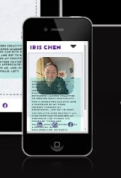

**Background Bug** - A bug was detected early in development in the background of the each page has different background position but using the same background. In every webpage due to using the different position cause the background has different effect in each pages. Afrer ask for turor Oisin's help, it just give me a click that I should put my background in the main instead giving it each pages.

Background Bug

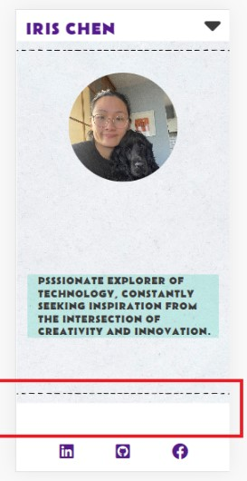

**Google Maps Embedding Bug** - A bug was detected when embedding the Google map to be used for the Get in touch Page. The developer was having trobule to set the map side by side with flex box. Casue the div element was place worng. After Adjust ansd mentor Koko's help were able to fixed and allow different screen sizes.

**Content flex box bug** - A bug was detected when using the flex box, the content was not able to have space evenly. And the content is not in the center, tried with padding and margin but not suitalbe with different screens. After call with mentor Koko she tuught me how to use CSS Grid and it was easy and able to solve the bug easily.

## Technologies Used

### Main Languages Used

- [HTML](https://validator.w3.org/#validate_by_upload "Link to HTML markup validation service")
- [CSS](https://validator.w3.org/#validate_by_upload "Link to CSS validation service")

### Frameworks, Libraries & Programs Used

- [Google Fonts](https://fonts.google.com/ "Link to Google Fonts")

- Google fonts was used to import the fonts "Belanosima", "Nanum Pen Script", "Sans-Serif" into the style.css file. These fonts were used throughout the project.
- [Font Awesome](https://fontawesome.com/ "Link to FontAwesome")
  - Font Awesome was used on almost all pages throughout the website to import icons (e.g. social media icons) for UX purposes.
- [Codeanywhere](https://codeanywhere.com/ "Link to codeanywhere homepage")
  - Codeanywhere was used for writing code, commiting, and then pushing to GitHub.
- [GitHub](https://github.com/ "Link to GitHub")
  - GitHub was used to store the project after pushing
- [Balsamiq](https://balsamiq.com/ "Link to Balsamiq homepage")
  - Balsamiq was used to create the wireframes during the design phase of the project.
- [Am I Responsive?](http://ami.responsivedesign.is/# "Link to Am I Responsive Homepage")
  - Am I Responsive was used in order to see responsive design throughout the process and to generate mockup imagery to be used.

[Back to top ⇧](#iris-chen-portfolio)

## Testing

### Manual Testing

**Home Nav bar icon**

- **_Expect_** - When clicked the nav bar will show all the pages and the colour will change to yellow.
- **_Action_** - clicked the nav bar on each page.
- **_Result_** - Home page open when clicked and colour cahnge to yellow.

Home Nav bar Icon

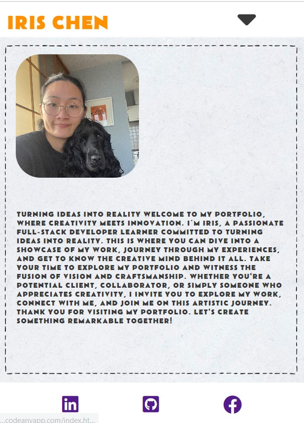

**_Form submit button_**

- **_Expect_** - Form submit when submit button is clicked if not put the required format will have error prompt.
- **_Action_** - clicked the submit button.
- **_Result_** - The form successfully submitted on click.

Form submit button

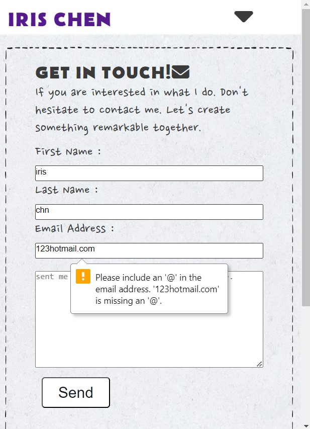

**_Social icon link_**

- **_Expect_** - Social icon when clicked will open another page and to the sign in page.
- **_Action_** - Clicked on the social icon
- **_Result_** - open a new page with sign in to your social account.

Social icon link

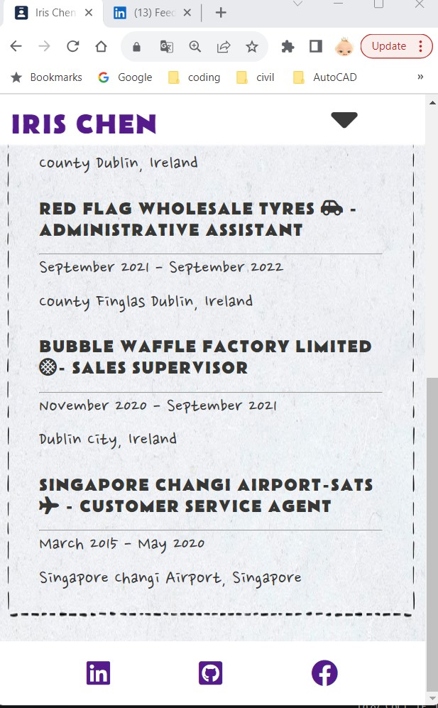

**_Home page profile photo_**

- **_Expect_** - Photo will change the size in different screen sizes.
- **_Action_** - change the screen from mobile to tablet 768px to 922px to 1200px
- **_Result_** - Profile photo cahnge it size when using the different screen siez.

Home page profile photo

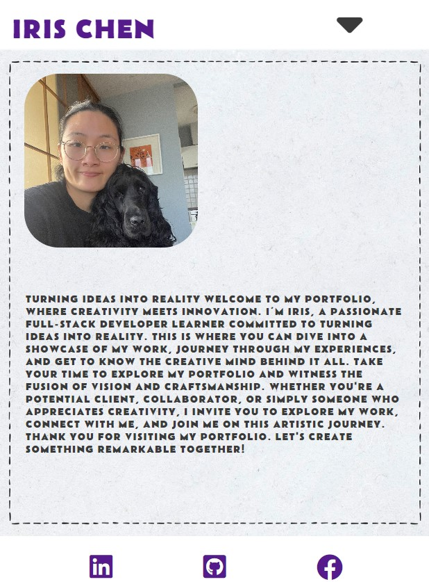

**_Home page content_**

- **_Expect_** - The content will change the position from bottom to the right side when change to big screen
- **_Action_** - Change the screen from small to full screen
- **_Result_** - The content change its position from bottom to the right side

Home page content

**_My Experience page_**

- **_Expect_** - The content will cahnge to space even when change to tablet and bigger screen sizes.
- **_Action_** - Change the screen from small to full screen
- **_Result_** - The content change its position from column to space even when use tablet and bigger screen sizes.

My Experience page

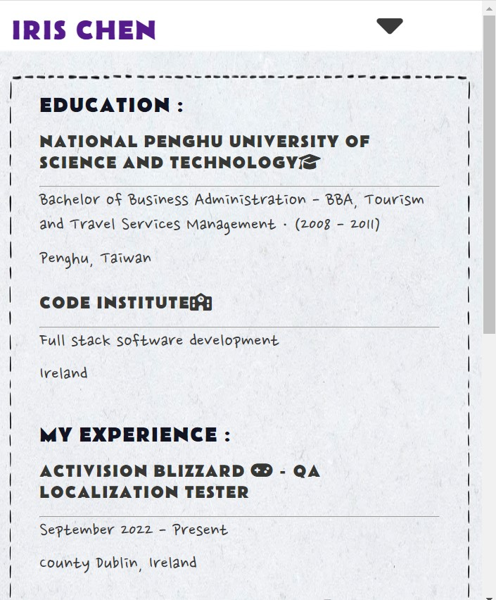
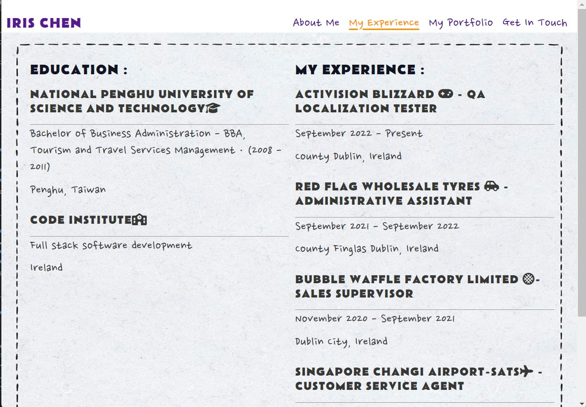

**_My portfolio page_**

- **_Expect_** - The content will change position from column to rows.
- **_Action_** - Change the screen from small to full screen
- **_Result_** - The content change its position to rows when change the screen sizes.

My portfolio page

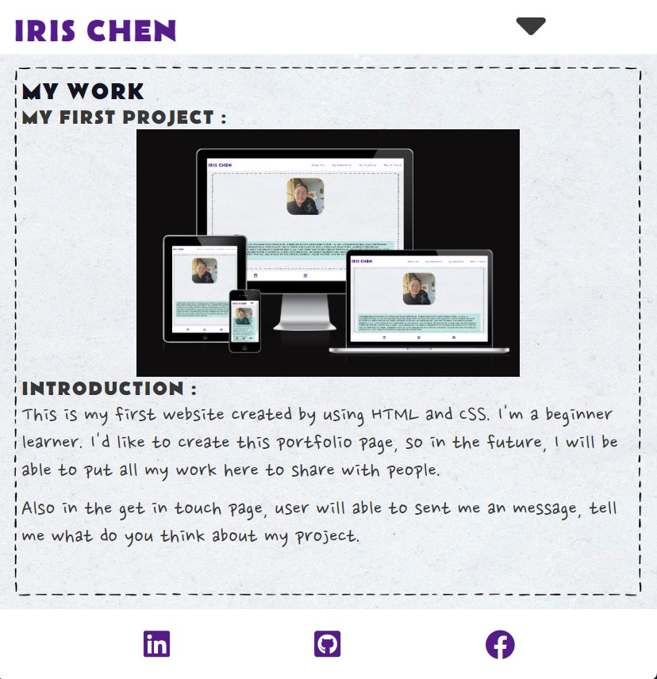
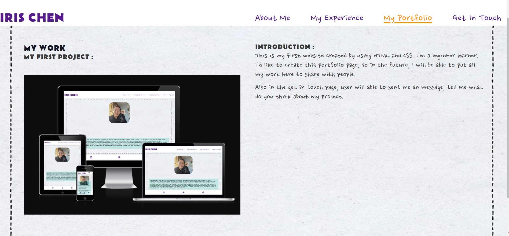

**_Get In Touch page_**

- **_Expect_** - The each input in required to fill out.
- **_Action_** - don't key in any thing and sent.
- **_Result_** - The system is required you to fill out the form before you submit.

Get In Touch page

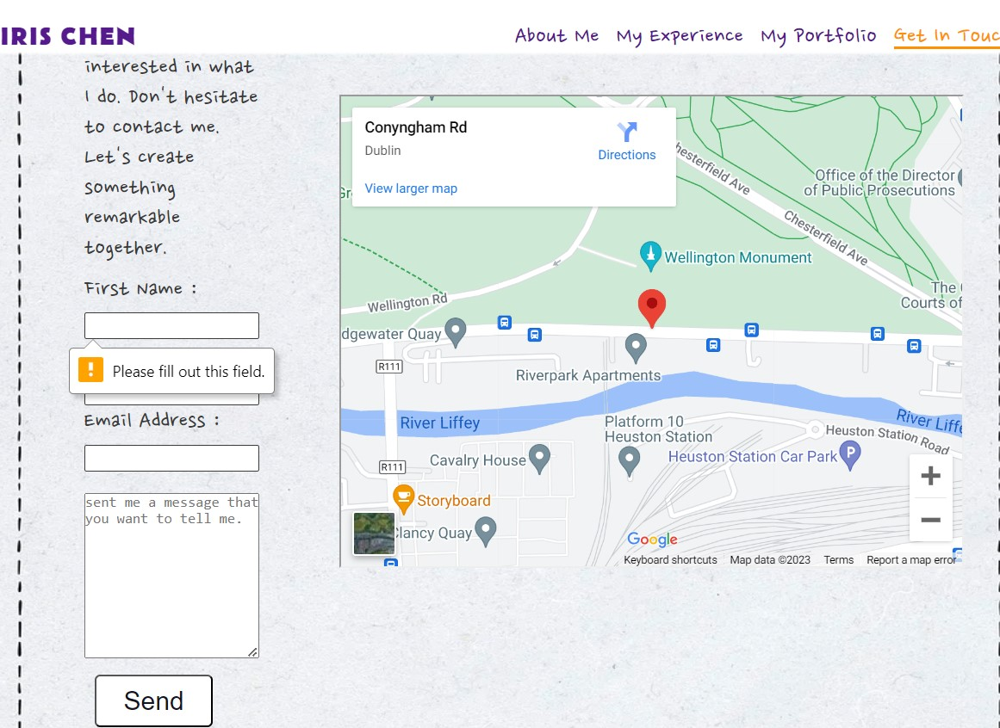

## Deployment

This project was developed using [codeanywhere](https://codeanywhere.com/ "Link to codeanywhere site"), which was then committed and pushed o GitHub using the GitPhub terminal.

### Deploying on GitHub Pages

To deploy this page to GitHub Pages from its GitHub repository, the following steps were taken:

1. Log into [GitHub](https://github.com/login "Link to GitHub login page") or [create an account](https://github.com/join "Link to GitHub create account page").
2. Locate the [GitHub Repository](https://github.com/Hsiaohan-89/Iris-Chen-portfolio "Link to GitHub Repo").
3. At the top of the repository, select Settings from the menu items.
4. Scroll down the Settings page to the "Pages" section.
5. Under "Source" click the drop-down menu labelled "None" and select "Main".
6. Upon selection, the page will automatically refresh meaning that the website is now deployed.
7. Scroll back down to the "Pages" section to retrieve the deployed link.

## Credits

### Content

- Some of the frame design ideas were borrowed and adapted from various sites below:
  - [Love Running website](https://github.com/Code-Institute-Solutions/readme-template)
  - [medium](https://medium.com/@skhans/the-25-best-personal-portfolio-website-design-inspiration-examples-e2eb1c8734df)

### Media

- Each pages backgronnd is source from [rawpixe](https://www.rawpixel.com/).
- The image in profile page and about me page is from the developer.

### Code

The developer consulted multiple sites in order to better understand the code they were trying to implement. For code that was copied and edited, the developer made sure to reference this with the code. The following sites were used on a more regular basis:

- [Stack Overflow](https://stackoverflow.com/ "Link to Stack Overflow page")
- [W3Schools](https://www.w3schools.com/ "Link to W3Schools page")

[Back to top ⇧](#iris-chen-portfolio)

## Acknowledgements

- I would like to thank my friend who gave me some of the advice for my own portfolio.
- I would like to thank my mentor koko and my tutor from the code institute for helping me when I had issues with my design and my code.
- I also like to thank my friends at Code Institute for their support when I met some issues they were very helpful.

[Back to top ⇧](#iris-chen-portfolio)

---
